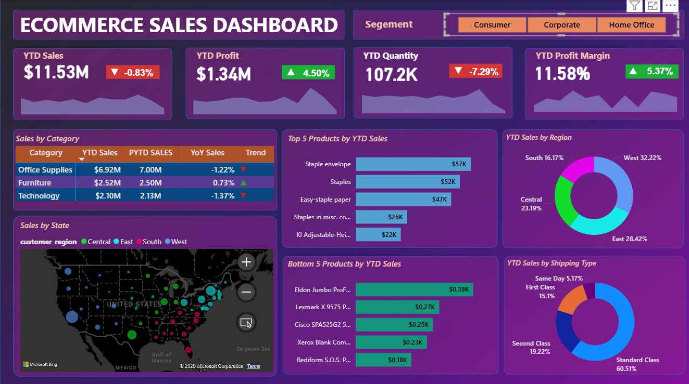
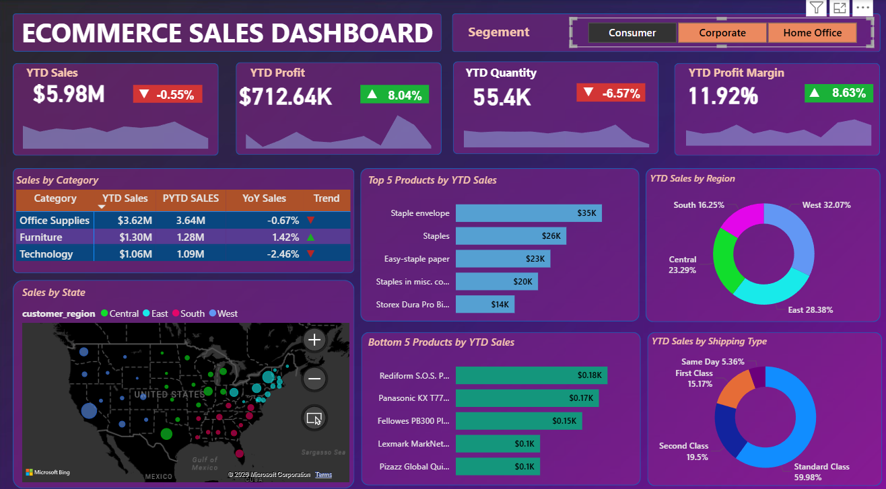
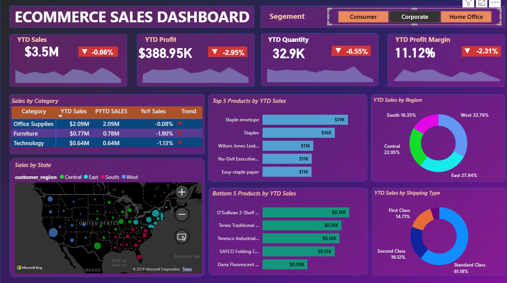
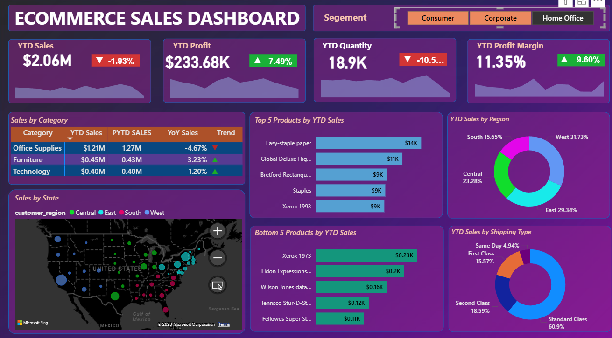

# 📊 E-Commerce Sales Analytics Dashboard

A **Power BI business intelligence dashboard** designed to analyze and visualize E-Commerce sales performance across multiple dimensions including **products, regions, shipping modes, and customer segments**.

This project demonstrates how businesses can transform **raw sales data into actionable insights** for better decision-making.

---

# 🚀 Project Overview

E-commerce companies generate massive volumes of transactional data every day. Without proper analytics, it becomes difficult to understand:

- Sales trends
- Profitability
- Product performance
- Customer behavior

This project builds an **interactive Power BI dashboard** that enables stakeholders to monitor **Key Performance Indicators (KPIs)** and explore sales insights across multiple dimensions.

---

# 🎯 Business Problem

Organizations often struggle to answer critical questions such as:

- Which **products generate the most revenue**?
- Which **regions contribute the most sales**?
- Which **shipping methods are most preferred**?
- How do **different customer segments perform**?
- Which **products are underperforming and need improvement**?

The dashboard solves these challenges through **data visualization and interactive analytics**.

---

# 🛠 Tech Stack

| Tool | Purpose |
|-----|-----|
| Power BI | Dashboard creation & data visualization |
| DAX | Calculations and KPIs |
| CSV Dataset | Data storage |
| Bing Maps | Geographical visualization |

---

# 📂 Dataset Description

The dataset includes the following attributes:

- Order ID
- Product Name
- Category
- Sales
- Profit
- Quantity
- Shipping Mode
- Customer Segment
- State
- Region

Additional geographic data was used for **state-level map visualization**.

### Files Used
Ecommerce Dataset.csv
US-States Longitudes-Latitudes Codes.csv

---

# 📊 Dashboard Features

## Key Performance Indicators

The dashboard tracks major metrics:

- **YTD Sales**
- **YTD Profit**
- **YTD Quantity**
- **Profit Margin**
- **Year-over-Year Growth**

These metrics provide a **quick overview of business performance**.

---

# 📈 Sales Analytics

## Sales by Category

Analyzes performance of major product categories:

- Office Supplies
- Furniture
- Technology

Includes **Year-to-Date vs Previous Year comparison**.

---

## Top 5 Products by Sales

Identifies products contributing the **highest revenue**.

---

## Bottom 5 Products by Sales

Helps identify **low-performing products** requiring attention.

---

## Sales by Region

Breakdown of sales distribution across:

- West
- East
- Central
- South

---

## Sales by Shipping Mode

Analysis of customer delivery preferences:

- Standard Class
- Second Class
- First Class
- Same Day

---

## Sales by State

Interactive **map visualization** showing **state-wise sales distribution across the United States**.

---

# 🖥 Dashboard Preview

## Overall Sales Dashboard

---

## Consumer Segment Dashboard

---

## Corporate Segment Dashboard

---

## Home Office Segment Dashboard

---

# 📊 Key Insights

From the dashboard analysis:

✔ **Office Supplies** contribute the highest share of total sales  
✔ **Standard Class shipping** dominates delivery preferences  
✔ **West region** generates the highest revenue  
✔ Certain products consistently appear in **bottom sales rankings**  
✔ Profit margins vary across **customer segments**

These insights help businesses improve **inventory planning, marketing strategies, and logistics decisions**.

---

# 📁 Repository Structure
Ecommerce Sales Analysis
│
├── Ecommerce Dataset.csv
├── US-States Longitudes-Latitudes Codes.csv
├── Ecommerce Sales Analysis.pbix
├── README.md
└── dashboard screenshots

---

# ⚡ How to Run the Project

1. Download or clone this repository
2. Open the `.pbix` file using **Power BI Desktop**
3. Load the dataset files if required
4. Explore the **interactive dashboard visuals and filters**

---

# 🌟 Future Enhancements

Possible improvements for the project:

- Sales forecasting using **time series analysis**
- Customer segmentation using **machine learning**
- Profit optimization analysis
- Integration with **real-time sales APIs**
- Advanced **customer behavior analytics**

---

# ⭐ Support

If you like this project:

⭐ **Star the repository**  
🍴 **Fork it for your own projects**  
📢 **Share it with others**

---
